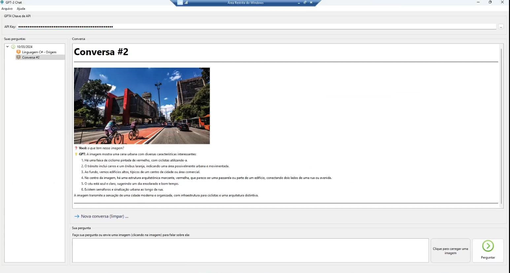

# GT-GPT4

ChatGPT built in C++ for Windows, Mac and Linux with OpenAI GPT4 API support and image recognition with OpenAI Vision

## What's done:

- Conversation Management
- Text conversations
- Image Recognition and Analysis
- Merging GPT4 contexts for text and Vision

## What remains to be finished:

- AI model selection

## Challenges:

- OAuth2 with OpenAI to obtain the API Key 
- Compatibility with Windows 7